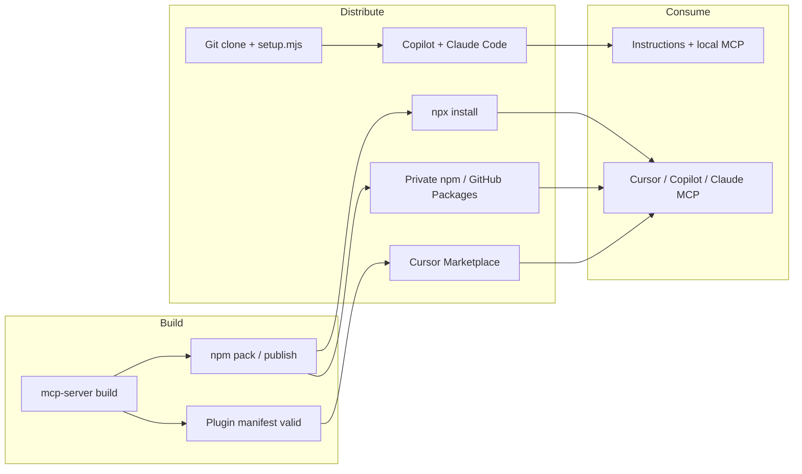

# Publishing Guide

How to distribute **angular-standards** to Cursor, GitHub Copilot, Claude, and internal teams.

There are **three distribution channels**. Most teams use at least two:

| Channel | Audience | What ships |
|---------|----------|------------|
| **npm** | All MCP hosts | `@enterprise/angular-standards-mcp` (stdio server + standards) |
| **Cursor Marketplace** | Cursor users | Plugin bundle (rules, skills, commands, MCP config) |
| **Git repository** | Copilot + Claude Code + internal | Templates, setup script, `.github/instructions` |

---

## Overview



**Critical rule:** For marketplace and `npx` installs, the MCP server must **not** depend on absolute paths into your dev machine. Consumers run:

```json
"command": "npx",
"args": ["-y", "@enterprise/angular-standards-mcp"]
```

Same pattern as `npx @angular/cli mcp`.

---

## Phase 1 — Pre-publish readiness

### 1.1 Legal & metadata

- [ ] Choose **open-source license** (MIT is fine; **required** for Cursor Marketplace)
- [ ] Add `LICENSE` at repo root
- [ ] Set real `author`, `repository`, `homepage` in `mcp-server/package.json`
- [ ] Confirm package name on npm (public: `@your-org/angular-standards-mcp` or unscoped `angular-standards-mcp`)

### 1.2 Build verification

```bash
cd angular-standards/mcp-server
rm -rf dist standards node_modules
npm install
npm run build
npm pack --dry-run   # inspect tarball contents: dist/ + standards/
```

Verify tarball includes:
- `dist/index.js` (with shebang)
- `standards/*.md` (all 13 sections)
- `package.json` with `bin`

Smoke test the packed package:

```bash
npm pack
npm install -g ./enterprise-angular-standards-mcp-0.1.0.tgz
angular-standards-mcp   # should start stdio MCP (blocks — that's correct)
```

Or without global install:

```bash
npx ./enterprise-angular-standards-mcp-0.1.0.tgz
```

### 1.3 Security checklist (marketplace + enterprise)

- [ ] No secrets in repo (API keys, tokens)
- [ ] MCP server is **read-only** (no file writes, no network calls) — document this in submission
- [ ] No `console.log` to stdout (corrupts stdio MCP) — use stderr only if logging
- [ ] Dependencies audited: `npm audit`

### 1.4 Plugin manifest checklist (Cursor)

- [ ] `.cursor-plugin/plugin.json` — valid `name` (kebab-case), `version`, `description`
- [ ] All `rules/*.mdc` have frontmatter (`description`, `globs` or `alwaysApply`)
- [ ] All `skills/*/SKILL.md` have `name` + `description` frontmatter
- [ ] All `commands/*.md` have frontmatter
- [ ] `README.md` documents install and MCP setup
- [ ] `mcp.json` uses `npx` (not dev-machine paths)
- [ ] No `..` or absolute paths in manifest
- [ ] Optional: `logo` in `assets/` referenced by relative path

### 1.5 Multi-plugin repo (this repository)

If the repo root is `ai-coding-standards` and the plugin lives in `angular-standards/`:

- [ ] Add `.cursor-plugin/marketplace.json` at **repository root**
- [ ] Entry `source` points to `./angular-standards`

---

## Phase 2 — Publish to npm

npm is the **primary runtime** for Copilot, Claude Desktop, Claude Code, and marketplace MCP.

### 2.1 Public npm (open source)

1. Create npm org or use unscoped name: https://www.npmjs.com/org/create
2. Login: `npm login`
3. Update `mcp-server/package.json`:

```json
{
  "name": "@your-org/angular-standards-mcp",
  "version": "0.1.0",
  "repository": {
    "type": "git",
    "url": "https://github.com/your-org/ai-coding-standards.git",
    "directory": "angular-standards/mcp-server"
  },
  "publishConfig": {
    "access": "public"
  }
}
```

4. Publish:

```bash
cd angular-standards/mcp-server
npm run build
npm publish --access public
```

5. Post-publish consumer config (all hosts):

**Cursor** — `.cursor/mcp.json`:

```json
{
  "mcpServers": {
    "angular-standards": {
      "command": "npx",
      "args": ["-y", "@your-org/angular-standards-mcp"]
    }
  }
}
```

**VS Code / Copilot** — `.vscode/mcp.json`:

```json
{
  "servers": {
    "angular-standards": {
      "type": "stdio",
      "command": "npx",
      "args": ["-y", "@your-org/angular-standards-mcp"]
    }
  }
}
```

**Claude Desktop** — merge into `claude_desktop_config.json`:

```json
{
  "mcpServers": {
    "angular-standards": {
      "command": "npx",
      "args": ["-y", "@your-org/angular-standards-mcp"]
    }
  }
}
```

**Claude Code** — project `.mcp.json`:

```json
{
  "mcpServers": {
    "angular-standards": {
      "type": "stdio",
      "command": "npx",
      "args": ["-y", "@your-org/angular-standards-mcp"]
    }
  }
}
```

### 2.2 Private npm (enterprise)

Options:

| Registry | Publish command |
|----------|-----------------|
| **GitHub Packages** | `npm publish --registry=https://npm.pkg.github.com` |
| **Azure Artifacts** | Configure `.npmrc` with feed URL |
| **Verdaccio / Artifactory** | Org-specific `publishConfig.registry` |

Teams add `.npmrc`:

```
@your-org:registry=https://npm.pkg.github.com
//npm.pkg.github.com/:_authToken=${NPM_TOKEN}
```

Copilot/Claude configs stay identical — only registry auth differs.

### 2.3 Versioning

- **Semver** for MCP package: `0.1.0` → `0.1.1` (fixes), `0.2.0` (new tools), `1.0.0` (stable API)
- Bump standards content → patch or minor depending on breaking review criteria
- Tag git: `git tag angular-standards-mcp-v0.1.0`

---

## Phase 3 — Publish to Cursor Marketplace

Official process: [cursor.com/marketplace/publish](https://cursor.com/marketplace/publish)

### 3.1 Requirements

| Requirement | Detail |
|-------------|--------|
| **Public Git repo** | GitHub, GitLab, etc. — must be inspectable |
| **Open source** | Mandatory — community can read all plugin code |
| **Manual review** | Security, quality, data handling (~1 week typical) |
| **Valid manifest** | `.cursor-plugin/plugin.json` or marketplace.json |
| **Updates reviewed** | Each marketplace update re-reviewed |

### 3.2 Prepare plugin MCP for marketplace

**Before submission**, update `angular-standards/mcp.json`:

```json
{
  "mcpServers": {
    "angular-standards": {
      "command": "npx",
      "args": ["-y", "@your-org/angular-standards-mcp"]
    }
  }
}
```

Do **not** ship dev paths like `${workspaceFolder}/.../dist/index.js` in marketplace plugins.

**Order of operations:** Publish npm package **first**, then submit Cursor plugin that references it.

### 3.3 Marketplace manifest (this repo layout)

At repository root `ai-coding-standards/.cursor-plugin/marketplace.json`:

```json
{
  "name": "ai-coding-standards",
  "owner": {
    "name": "Your Organization",
    "email": "platform@your-org.com"
  },
  "metadata": {
    "description": "Enterprise frontend architecture governance plugins",
    "version": "0.1.0"
  },
  "plugins": [
    {
      "name": "angular-standards",
      "source": "./angular-standards",
      "description": "Enterprise Angular architecture standards, PR review, and MCP tools",
      "version": "0.1.0",
      "keywords": ["angular", "architecture", "mcp", "code-review"]
    }
  ]
}
```

### 3.4 Submission steps

1. Push all changes to **public** `main`
2. Ensure `CHANGELOG.md` documents v0.1.0
3. Test plugin locally in Cursor (install from folder or dev symlink)
4. Go to [cursor.com/marketplace/publish](https://cursor.com/marketplace/publish)
5. Submit repository URL (e.g. `https://github.com/your-org/ai-coding-standards`)
6. In submission notes, include:
   - What MCP tools do (read-only standards retrieval + heuristic scan)
   - npm package name and version
   - No network access, no file mutations
   - Pairing with `@angular/cli mcp` recommended

### 3.5 After approval

- Users install from Cursor Marketplace (one click)
- Plugin delivers: rules, skills, commands, MCP config
- MCP runtime pulled via `npx` on first use

### 3.6 Publishing updates

1. Bump `mcp-server` version → `npm publish`
2. Bump `angular-standards/.cursor-plugin/plugin.json` version
3. Bump marketplace entry version if changed
4. Update `CHANGELOG.md`
5. Push to `main` — Cursor team reviews update before listing refresh

---

## Phase 4 — GitHub Copilot & Claude (without marketplace)

These hosts do **not** use Cursor plugins. Distribution is:

### 4.1 Repository templates (version-controlled)

Commit into each Angular monorepo (or use `setup.mjs`):

| File | Host |
|------|------|
| `.vscode/mcp.json` | Copilot |
| `.github/copilot-instructions.md` | Copilot workspace |
| `.github/instructions/angular.instructions.md` | Copilot file-scoped |
| `.mcp.json` | Claude Code |
| `CLAUDE.md` | Claude Code |

```bash
node angular-standards/scripts/setup.mjs --target /path/to/angular-app --host all
```

### 4.2 GitHub Copilot coding agent (cloud)

- Commit `.github/copilot-instructions.md` and `.github/instructions/*.instructions.md`
- Cloud agent and Copilot code review pick these up from the repo
- MCP requires VS Code / Copilot agent mode with local MCP — document in README

### 4.3 Internal monorepo pattern

```bash
# Option A: git submodule
git submodule add https://github.com/your-org/ai-coding-standards tools/ai-coding-standards

# Option B: npm devDependency
npm install --save-dev @your-org/angular-standards-mcp
```

Add to root `package.json` postinstall (optional):

```json
"scripts": {
  "setup:ai-standards": "node tools/ai-coding-standards/angular-standards/scripts/setup.mjs --target . --host all"
}
```

---

## Phase 5 — Recommended release order

```
1. Finalize standards content + MCP tools
2. npm publish (@your-org/angular-standards-mcp)
3. Update plugin mcp.json to npx reference
4. Add marketplace.json + CHANGELOG + LICENSE
5. Push public repo
6. Submit Cursor Marketplace
7. Document internal rollout (setup.mjs + Copilot instructions)
8. Announce version in internal Slack / ADR
```

---

## Troubleshooting

| Issue | Fix |
|-------|-----|
| MCP red dot in Cursor | `npx -y @your-org/angular-standards-mcp` in terminal; fix errors |
| Copilot shows no tools | Use `servers` key + `type: "stdio"`; reload window |
| Claude Desktop no tools | Absolute `npx` path if `npx` not in PATH; full app restart |
| Marketplace rejected | Usually: non-open license, MCP writes files, or dev paths in mcp.json |
| `npx` slow on first run | Expected — caches package; document for teams |
| Windows PATH | Use full path to `npx.cmd` in MCP config if needed |

---

## What you need before starting

| Item | Public marketplace | Private enterprise |
|------|-------------------|-------------------|
| Public GitHub repo | Required | Optional |
| npm registry | public npm | private registry |
| Open source license | Required | Your choice |
| Cursor review | Required | N/A (git/submodule install) |
| npm org / package name | Reserved on npmjs.com | Internal registry |

---

## Next actions for this repo

1. Replace `@enterprise` with your real npm scope
2. Add `LICENSE`, `CHANGELOG.md`, root `marketplace.json`
3. Switch `mcp.json` from local `node` path to `npx` after first npm publish
4. Run `npm pack --dry-run` and fix any missing files
5. Submit at [cursor.com/marketplace/publish](https://cursor.com/marketplace/publish)
